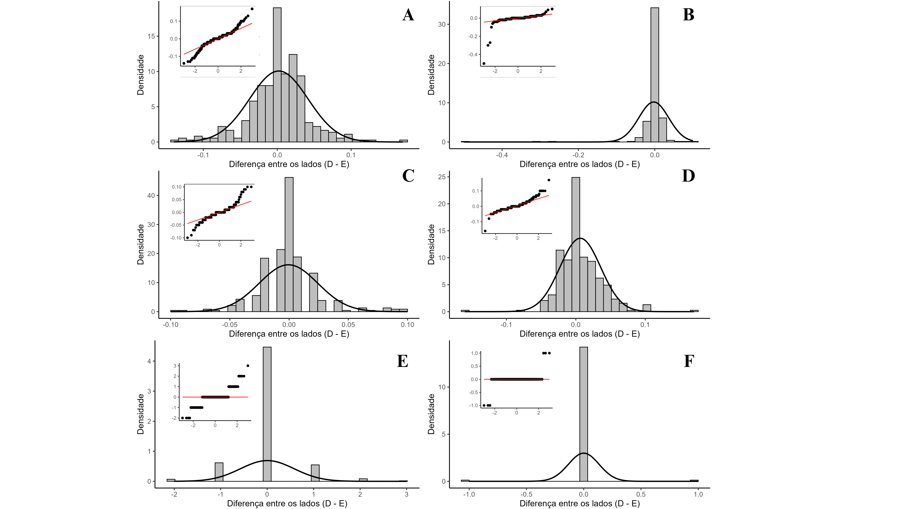
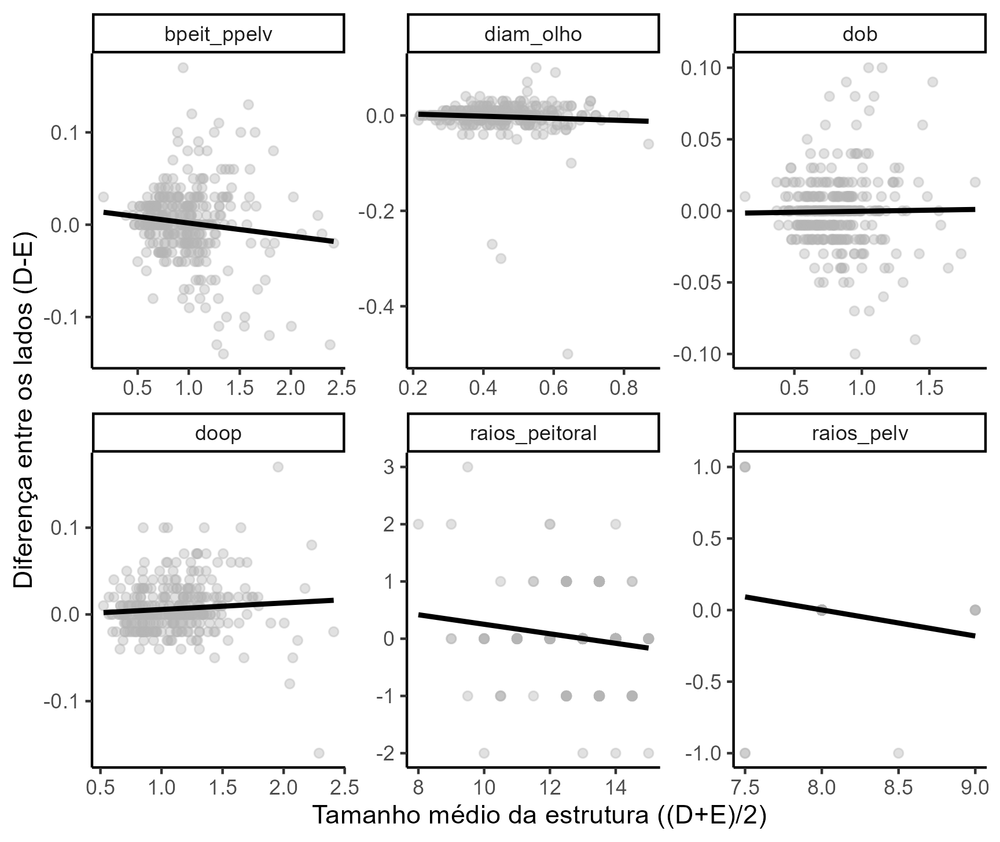
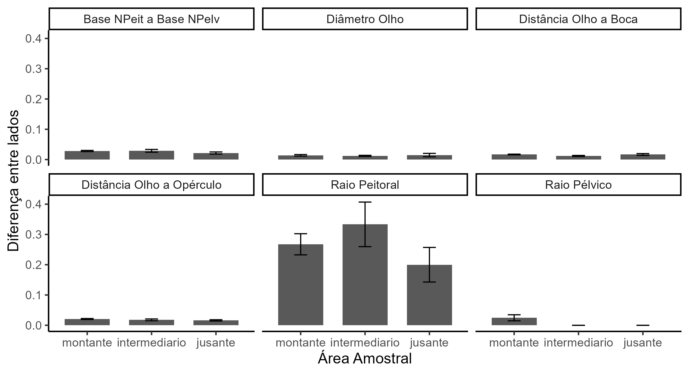

# 📊 Análise Exploratória de Assimetria Bilateral
<!-- BADGES -->


Este repositório apresenta uma análise detalhada da **variação bilateral de estruturas morfológicas**, abordando normalidade, magnitude da assimetria (D–E), dependência do tamanho, e diferenças multivariadas entre zonas amostrais usando **PERMANOVA**.

---

# 🧬 Objetivo

Avaliar:

- Assimetria flutuante (AF)
- Assimetria direcional (AD)
- Se a assimetria depende do tamanho médio dos caracteres
- Diferenças multivariadas entre zonas amostrais

---

# 🛠️ Pacotes Utilizados

```r
tidyverse
rstatix
moments
e1071
ggpmisc
vegan
pairwiseAdonis
```

# 📌 Resumo dos Resultados
## ✔️ 1. Normalidade das Diferenças (D–E)

- Os testes de Shapiro-Wilk mostraram que a maioria dos caracteres não segue distribuição normal, mesmo com média próxima de zero.

📌 Conclusão: os caracteres apresentam variação bilateral não direcional, não podendo ser classificados como AF pura.

## ✔️ 2. Correlação entre Assimetria e Tamanho

- Correlação entre:

    1. Diferença bilateral (D–E)

    2. Tamanho médio ((D+E)/2)

### Resultados:

* A maioria dos caracteres não apresentou correlação significativa

* Alguns caracteres isolados mostraram correlação importante

📌 Conclusão: a assimetria não depende do tamanho na maior parte dos casos.

## ✔️ 3. PERMANOVA — Diferenças Entre Zonas

A PERMANOVA identificou diferenças significativas entre algumas zonas. O post-hoc indicou quais pares de zonas diferem.

📌 Conclusão: zonas diferentes apresentam padrões distintos de variação morfológica.
----

# 🖼️ Gráficos
🔹Histograma + QQ Plot - Verificar tipo de assimetria



🔹 Correlação — Diferença × Tamanho Médio


🔹 PERMANOVA — Post-hoc


🔹 PERMANOVA — Médias das Diferenças por Zona


🔹 Distribuição das Diferenças por Zona (Violin + Boxplot)

